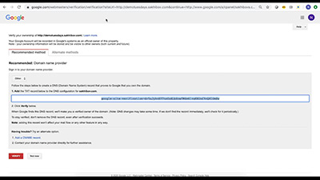
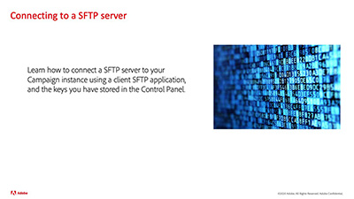

# Tutoriales del Panel de control

El Panel de control de Adobe Campaign permite a los administradores de Adobe Campaign monitorizar los recursos clave y realizar tareas administrativas, como por ejemplo, la administración del almacenamiento SFTP por instancia, la administración de claves GPG, o de subdominios y certificados.

## Selección de personal

<table>
<tr>
  <td>
    
    

      <a href="./subdomains-and-certificates/subdomain-delegation.md">
    <strong>Delegación de subdominios en Adobe Campaign (vídeo)</strong>
    </a>
    

    

    <em>Obtenga información sobre cómo delegar completamente un subdominio a Adobe Campaign.</em>
    

  </td>
   <td>
    
    

    <a href="./subdomains-and-certificates/google-txt-record-management.md">
    <strong>Administración de registros TXT de Google (vídeos)</strong>
    </a>
    

    

    <em> Aprenda cómo añadir los registros de verificación del sitio TXT de Google a todos los subdominios utilizados para enviar correos electrónicos a las direcciones de GMAIL con el Panel de control de Campaign.</em>
    

  </td>
  <td>
    
    

      <a href="./sftp-management/connect-to-sftp-server.md">
    <strong>Conexión a un servidor SFTP</strong>
    </a>
    

    

    <em>Aprenda cómo conectar con el servidor SFTP con una aplicación SFTP de cliente, utilizando las claves almacenadas en el Panel de control. </em>
    

  </td>
</tr>
</table>

## Recursos adicionales

* [Centro de ayuda del Panel de control](https://experienceleague.adobe.com/docs/control-panel/using/control-panel-home.html?lang=es)
